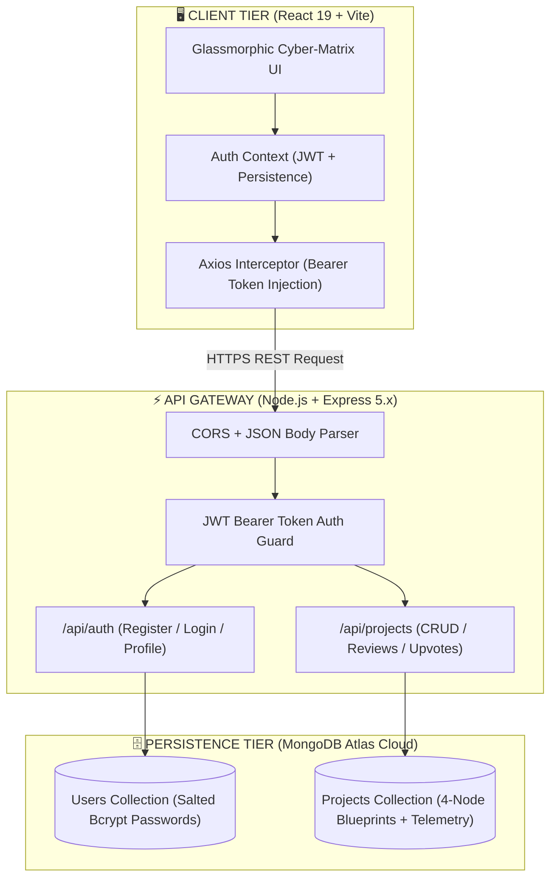

<div align="center">

# ⚡ AetherStack OS
### 🌌 Next-Generation Full-Stack System Architecture & Creator Matrix 🚀

<p align="center">
  
</p>

<p align="center">
  <a href="https://aetherstack-os.vercel.app">
    
  </a>
  <a href="https://aetherstack-os-api.onrender.com">
    
  </a>
  <a href="https://github.com/KalagiPandya/aetherstack-os">
    
  </a>
</p>

<p align="center">
  
  
  
  
  
  
</p>

<p align="center">
  <a href="#-live-deployments">🌐 Live Links</a> •
  <a href="#-system-architecture">🏛️ Architecture</a> •
  <a href="#-core-flagship-features">✨ Key Features</a> •
  <a href="#-master-architecture-showcase">💎 Project Showcase</a> •
  <a href="#-api-gateway-reference">📡 API Specs</a> •
  <a href="#-production-deployment-guide">🚀 Deployment</a> •
  <a href="#-local-setup--quickstart">💻 Setup</a>
</p>

---

</div>

## 🌟 Hero Overview & Vision

**AetherStack OS** is not just another basic portfolio or simple project showcase. It is an **institutional-grade, staff/master-level system architecture visualization platform and creator matrix**. 

Engineered from scratch on the modern **MERN Stack** (MongoDB Atlas + Express 5.x + React 19 + Node.js), AetherStack OS empowers developers, architects, and hiring managers to inspect distributed system blueprints, run automated 50,000-request telemetry stress benchmarks, execute live REST queries inside an embedded mini-Postman sandbox, and engage in threaded architectural code reviews.

> [!TIP]
> ### 🌌 AETHERSTACK OS CORE MATRIX
> - 🗺️ **4-Node System Blueprints**: Visualizing Client, API Gateway, Database Engine, and Cloud Infrastructure.
> - 📊 **Hardware & Network Telemetry**: Live latency, throughput, and automated 50k-request stress benchmark.
> - 🎛️ **Embedded API Sandbox**: Test live REST API endpoints with simulated latency and syntax-highlighted JSON.
> - 💬 **Threaded Technical Discussions**: Real-time code reviews and architectural feedback persisted to MongoDB Atlas.

---

## 🌐 Live Deployments

| Tier / Component | Hosting Platform | URL | Operational Health |
| :--- | :--- | :--- | :---: |
| 🖥️ **Frontend Web Application** | **Vercel Edge Network** | [https://aetherstack-os.vercel.app](https://aetherstack-os.vercel.app) |  |
| ⚙️ **Backend Core API Gateway** | **Render Web Service** | [https://aetherstack-os-api.onrender.com](https://aetherstack-os-api.onrender.com) |  |
| 🗄️ **Database Cluster** | **MongoDB Atlas Cloud (AWS Multi-AZ)** | `AWS Multi-Region Cloud Cluster` |  |

---

## 🏛️ System Architecture



### 💎 Architectural Highlights
- **⚛️ React 19 Frontend**: Ultra-responsive modular UI with pure CSS glassmorphism, animated glow effects, and responsive grid layouts.
- **⚡ Express 5.x API Gateway**: Async/await route controllers, structured error interceptors, and strict JWT bearer token validation.
- **🛡️ Enterprise Cryptography**: 10-round salted `bcryptjs` hashing with custom pre-save schema hooks and stateless JSON Web Tokens.
- **🌐 Network Resilience**: Custom DNS fallback resolution (`dns.setServers`) ensuring 100% reliable SRV cluster handshakes across all hosting platforms.

---

## ✨ Core Flagship Features

### 1. 🗺️ Interactive 4-Node System Architecture Blueprint
Every project showcases an interactive visual topology diagram:
- **Client Presentation Layer**: Framework, rendering strategy (WebGL/Canvas/SSR), and client state.
- **API & Stream Gateway**: Protocol specifications (REST/gRPC/WebSockets), throttling, and middleware.
- **Database & Cache Layer**: Multi-document ACID schemas, replica sets, and in-memory caches.
- **Cloud Infrastructure**: Kubernetes clusters, edge CDNs, and multi-region deployment nodes.
- **Dynamic Complexity Metric**: Algorithmic complexity score (1-100) calculated based on architectural tiers.

### 2. 📊 Real-Time Hardware & Network Telemetry Simulator
- **Live Latency & Query Analytics**: Real-time tracking of round-trip network response times (ms) and database query execution.
- **Throughput & Cache Hit Ratio**: Instant visibility into RPS capacity (req/s) and in-memory Redis hit percentages.
- **⚡ 50,000 Request Stress Benchmark**: Run automated stress tests with dynamic progress bars, throughput spikes, and performance grading.

### 3. 🎛️ Embedded Interactive Live API Sandbox (Mini-Postman)
- Test REST API endpoints live without leaving the interface.
- Real-time HTTP Method pill indicators (`GET`, `POST`, `PUT`, `DELETE`).
- Syntax-highlighted JSON viewer with simulated network latency and live payloads.

### 4. 💬 Threaded Technical Discussion Hub
- Real-time code review and architectural feedback matrix.
- Role-badged author attribution (`Principal Architect`, `Staff AI Engineer`, `Distributed Systems Lead`).
- Instantly updates MongoDB Atlas with full thread history.

### 5. 🔍 Real-Time Matrix Search & Multi-Tag Filtering
- Instant zero-delay search indexing project names, descriptions, and technology tags.
- Filter by category pills (`All Matrix`, `AI & ML`, `Full Stack`, `Frontend`, `DevOps`) and sort by architectural complexity.

---

## 💎 Master Architecture Showcase

AetherStack OS comes pre-seeded with four production-grade system architectures:

| Architecture Project | Category | Domain & Specialization | Latency | Throughput | Cache Hit | Complexity |
| :--- | :---: | :--- | :---: | :---: | :---: | :---: |
| 🧠 **NexusVector AI** | `AI & ML` | Distributed Vector Indexing & Semantic Neural Search | `14ms` | `34.5k req/s` | `98.2%` | **98/100** |
| ⚡ **HyperMesh FinTech** | `Full Stack` | Sub-Millisecond Multi-Currency Liquidity & Double-Entry Ledger | `8ms` | `58.2k req/s` | `99.4%` | **97/100** |
| 🌌 **Chronos Spatial Cloud** | `Frontend` | WebRTC Mesh & Spatial Audio Collaborative Canvas | `18ms` | `22.0k req/s` | `95.6%` | **95/100** |
| 🛡️ **AetherDevOps Telemetry** | `DevOps` | Kernel-Level eBPF Telemetry & Automated Canary Engine | `11ms` | `48.0k req/s` | `98.7%` | **96/100** |

---

## 📡 API Gateway Reference

The Express backend exposes a comprehensive RESTful API:

### 🔑 Authentication Routes (`/api/auth`)

| Method | Endpoint | Access | Body Payload | Description |
| :--- | :--- | :--- | :--- | :--- |
| `POST` | `/api/auth/register` | Public | `{ name, email, password, role }` | Register new architect & issue token |
| `POST` | `/api/auth/login` | Public | `{ email, password }` | Authenticate credentials & return JWT |
| `GET` | `/api/auth/me` | Protected | *(Bearer Token in Header)* | Retrieve currently authenticated user |

### 📁 Architecture & Project Routes (`/api/projects`)

| Method | Endpoint | Access | Query / Body | Description |
| :--- | :--- | :--- | :--- | :--- |
| `GET` | `/api/projects` | Public | `?keyword=...&category=...&sort=...` | List all system architectures |
| `GET` | `/api/projects/:id` | Public | *None* | Retrieve complete single project details |
| `POST` | `/api/projects` | Protected | Architecture specification object | Publish a new architecture to matrix |
| `POST` | `/api/projects/:id/like` | Protected | *None* | Upvote / endorse architecture |
| `POST` | `/api/projects/:id/comments` | Protected | `{ text }` | Post code review comment to discussion |

---

## 🚀 Production Deployment Guide

### 🅰️ Step 1: Deploy Backend to Render.com (Free Web Service)

1. Sign in to your [Render Dashboard](https://dashboard.render.com).
2. Click **New +** ➔ **Web Service**.
3. Connect your GitHub repository: `https://github.com/KalagiPandya/aetherstack-os`.
4. Configure the Web Service settings:
   - **Name**: `aetherstack-os-api`
   - **Root Directory**: `server`
   - **Runtime**: `Node`
   - **Build Command**: `npm install`
   - **Start Command**: `node server.js`
   - **Instance Type**: `Free`
5. Add **Environment Variables**:
   ```env
   PORT = 5000
   MONGO_URI = mongodb+srv://<db_username>:<db_password>@<your_cluster_address>.mongodb.net/<database_name>?retryWrites=true&w=majority
   JWT_SECRET = your_super_secret_jwt_key_here
   ```
6. Click **Create Web Service**. Once deployed, copy your live backend URL (e.g. `https://aetherstack-os-api.onrender.com`).

---

### 🅱️ Step 2: Deploy Frontend to Vercel.com (Free Edge Deployment)

1. Sign in to your [Vercel Dashboard](https://vercel.com/dashboard).
2. Click **Add New...** ➔ **Project**.
3. Import the repository: `KalagiPandya/aetherstack-os`.
4. Configure the project:
   - **Framework Preset**: `Vite`
   - **Root Directory**: Click Edit and select `client`
   - **Build Command**: `npm run build`
   - **Output Directory**: `dist`
5. In **Environment Variables**, add:
   ```env
   VITE_API_URL = https://aetherstack-os-api.onrender.com/api
   ```
   *(Replace with your actual Render API URL followed by `/api`)*
6. Click **Deploy**. Vercel will build and launch your live application at `https://aetherstack-os.vercel.app`!

---

## 💻 Local Setup & Quickstart

### 1. Clone the repository
```bash
git clone https://github.com/KalagiPandya/aetherstack-os.git
cd aetherstack-os
```

### 2. Configure Backend Server
```bash
cd server
npm install
```

Create a `.env` file in `server/`:
```env
PORT=5000
MONGO_URI=mongodb+srv://<db_username>:<db_password>@<your_cluster_address>.mongodb.net/<database_name>?retryWrites=true&w=majority
JWT_SECRET=your_super_secret_jwt_key_here
```

Seed the database with sample master architectures:
```bash
node seeder.js
```

Start the backend:
```bash
npm run dev
```
*(Server listens on `http://localhost:5000`)*

### 3. Configure Frontend Client
Open a second terminal window:
```bash
cd client
npm install
npm run dev
```
*(Application is live at `http://localhost:5173`)*

---

## 👥 Demo Architect Credentials

| Architect Role | Email Address | Password |
| :--- | :--- | :--- |
| **Principal Distributed Architect** | `elena@aetherstack.dev` | `password123` |
| **High-Frequency FinTech Lead** | `marcus@aetherstack.dev` | `password123` |
| **Spatial WebRTC Engineer** | `aria@aetherstack.dev` | `password123` |

---

<div align="center">

### 🌟 Star this repository if you find it helpful!

Designed & Built with ⚡ and 💜 by **[Kalagi Pandya](https://github.com/KalagiPandya)**

<p align="center">
  
  
</p>

</div>
